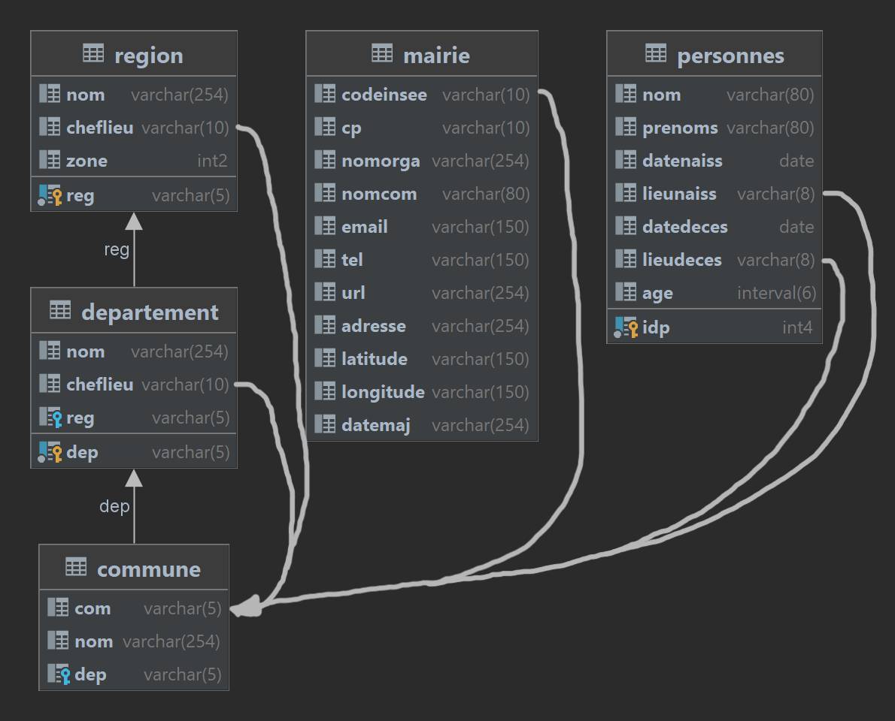

Schema
---



# Exercice 1 - SQL

## Q1

projection sur la relation 'personnes'

```sql
SELECT p.idp, p.nom, p.prenoms
```

jointures pour le lieu de naissance

```sql
FROM personnes p
JOIN commune cn ON p.lieunaiss=cn.com
JOIN departement dn ON cn.dep=dn.dep
JOIN region rn ON dn.reg=rn.reg
```

jointures pour le lieu de deces

```sql
JOIN commune cd ON p.lieudeces=cd.com
JOIN departement dd ON cd.dep=dd.dep
JOIN region rd ON dd.reg=rd.reg
```

```sql
WHERE rn.nom = 'Hauts-de-France' AND rd.nom = 'Occitanie'
```

**Count:** 54357

## Q2

```sql
SELECT m.adresse, m.email
```

```sql
FROM mairie m
JOIN personnes p ON m.codeInsee=p.lieunaiss
JOIN commune cd ON p.lieudeces=cd.com
```

> /!\ Attention ! C'est p.lieuNAISS

```sql
WHERE cd.dep='63' AND to_char(p.datedeces, 'yyyy-mm')='2018-04'
```

**Count:** 509

## Q3

- v1 - **Count:** 3036725:

```sql
SELECT COUNT(*)
FROM personnes p
LEFT OUTER JOIN commune c ON p.lieunaiss=c.com
WHERE c is NULL
```

- v2 - **Count:** 3036725:

```sql
SELECT COUNT(*)
FROM personnes p
WHERE p.lieunaiss NOT IN
(SELECT com FROM commune)
```

Pour ne pas compter les lieux de naissance dont la valeur on ne connait pas, ajouter une condition dans le WHERE:

```sql
p.lieunaiss IS NOT NULL
```

# Exercice 2 - Fragmentation

## Q1 - Plan de Fragmentation

1) sur la table **region** -> fragmentation de type **horizontale**
2) departement -> horizontale, derivee de region
3) commune -> horizontale, derivee de departement
4) personne -> verticale
	- -> relation "personne_age", attributs: (*idp* et age)
	- -> relation "personne_info", attributs: (*idp* et tout sauf age)

> Chaque fragment doit contenir la cle primaire de la relation de depart, afin de pouvoir de la reconstruire a partir de ces fragments. C'est une des conditions de la "Fragmentation Correcte".

5) personne_info `JOIN` commune -> hybride
	- horizontale -> verticale
	- attributs: (*idp*, nom, prenom, date**naiss**, lieu**naiss**)

> Hybride: a la fois horizontale et verticale. 

6) personne_info `JOIN` commune -> hybride
	- horizontale -> verticale
	- attributs: (*idp*, nom, prenom, date**deces**, lieu**deces**)

7) replication logique de Paris et Marseille a partir de la table de Nantes

## Q2 - En Algèbre Relationnelle

### C1 - Régions

- Fragmentation horizontale \
-> Opérateur de Séléction \
-> Condition dans le `WHERE`


### C2 - Départements

- Fragmentation horizontale, derivee de region \
Equivalent à `LEFT OUTER JOIN` avec `IS NULL` (Voir Ex1.Q3)

Tous les departements qui existent dans la table `region1`. 


De même, pour les deux autres...

### C3 - Communes

- Fragmentation horizontale, derivee de departement \
Pareil que C2.

### C4 - Les ages des personnes

- Fragmentation verticale \
-> Opérateur de Projéction \
-> Attributs dans le `SELECT`


### C5 - Naissances

- Fragmentation hybride (ou mixte)


De même, pour les deux autres...

### C6 - Décès

- Fragmentation hybride (ou mixte) \
Pareil que C5, mais avec `datedeces`.

## Q3 - Fragmentation Correcte

Une fragmentation est dite **correcte** ssi:
1) pas de pertes de donnees
2) possibilite de reconstruire la relation de depart
	- -> inclure les cles primaires dans les fragments
3) pas de duplication de donnees
4) transparent pour l'utilisateur (acces unifie)

Donc, cette fragmentation n'est pas correcte, car:
- duplication de mairies + de noms et de prenoms

# Exercice 3

## Regions, Departements et Communes


## Personnes


# Exercice 4

Voir la correction.