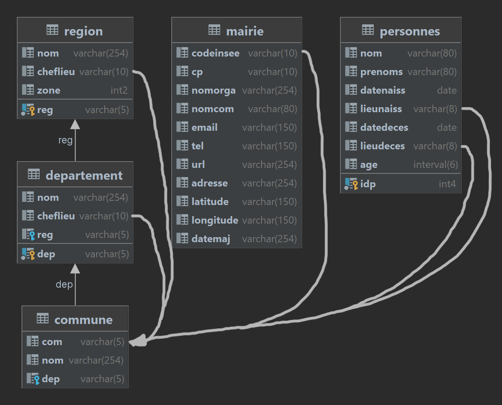

Schema
---



A & B - Fragmentation
---

### Pre-requisites - Définition des connexions inter-bases

Voir le [[td1-ggmd|TD1 GGMD]].

Repeat for each distributed database:

- En tant qu'`admin`:

	```bash
	psql -h localhost -U postgres -d insee
	```
	
	```sql
	CREATE EXTENSION postgres_fdw;
	
	CREATE SERVER ggmd_prof
	FOREIGN DATA WRAPPER postgres_fdw
	OPTIONS (host '192.168.246.201', port '5432', dbname 'insee');
	
	GRANT USAGE ON FOREIGN SERVER ggmd_prof TO etum2;
	```
	
	```bash
	exit # ou ctrl+d
	```

- En tant qu'`etum2`:

	```bash
	psql -h localhost -U etum2 -d insee
	```

	Create mapping entre les 2 utilisateurs (local/distant)
	```sql
	CREATE USER MAPPING
	FOR CURRENT_USER
	SERVER ggmd_prof
	OPTIONS(user 'etum2', password 'etum2');
	```
	
	```bash
	exit # ou ctrl+d
	```

> Tout le reste est à executer en tant qu'`etum2` !

### C1 - Distribuer la relation "region"

Repeat for each distributed database, **changing the zone**:
- **zone=1**: Paris (Small VM)
- **zone=2**: Nantes (Medium VM)
- **zone=3**: Marseille (Large VM)

	```sql
	CREATE FOREIGN TABLE remote_region(
		reg varchar(5),
		nom varchar(254),
		cheflieu varchar(10),
		zone smallint
	)
	SERVER ggmd_prof
	OPTIONS (schema_name 'public', table_name 'region');
	
	CREATE TABLE region AS (
		SELECT *
		FROM remote_region
		WHERE zone = 1
	);
	
	DROP FOREIGN TABLE remote_region;
	```

### C2 - Distribuer la relation "departement"

> La meme requete pour 3 serveurs ! Car depend de l'attribut `reg` de la relation `region`, qui est deja divisé en 3 serveurs.

Repeat for each distributed database:

```sql
CREATE FOREIGN TABLE remote_departement(
	dep varchar(5),
	nom varchar(254),
	cheflieu varchar(10),
	reg varchar(5)
)
SERVER ggmd_prof
OPTIONS (schema_name 'public', table_name 'departement');

CREATE TABLE departement AS (
	SELECT *
	FROM remote_departement
	WHERE reg in (SELECT reg from region)
);
```

### C3 - Distribuer la relation "commune"

> La meme requete pour 3 serveurs ! Car depend de l'attribut `dep` de la relation `departement`, qui est deja divisé en 3 serveurs.

Repeat for each distributed database:
```sql
CREATE FOREIGN TABLE remote_commune(
	com varchar(5),
	nom varchar(254),
	dep varchar(5)
)
SERVER ggmd_prof
OPTIONS (schema_name 'public', table_name 'commune');

CREATE TABLE commune AS (
	SELECT *
	FROM remote_commune
	WHERE dep in (SELECT dep from departement)
);
```

### C4 - Distribuer les ages des personnes
**! ONLY FOR PARIS !**:
```sql
CREATE FOREIGN TABLE remote_personnes(
	idp integer,
	nom varchar(80),
	prenoms varchar(80),
	datenaiss date,
	lieunaiss varchar(8),
	datdeces date,
	lieudeces varchar(8),
	age interval
)
SERVER ggmd_prof
OPTIONS (schema_name 'public', table_name 'personnes');

CREATE TABLE personnes_age AS (
	SELECT idp, age
	FROM remote_personnes
);
```

### C5 - Naissances

Create remote_personnes **only** for **Nantes (med)** and **Marseille (large)**:
```sql
CREATE FOREIGN TABLE remote_personnes(
	idp integer,
	nom varchar(80),
	prenoms varchar(80),
	datenaiss date,
	lieunaiss varchar(8),
	datdeces date,
	lieudeces varchar(8),
	age interval
)
SERVER ggmd_prof
OPTIONS (schema_name 'public', table_name 'personnes');
```

Repeat for **each** distributed database:
```sql
CREATE TABLE personnes_naiss AS (
	SELECT idp, nom, prenoms, datenaiss, lieunaiss
	FROM remote_personnes
	WHERE lieunaiss in (SELECT com FROM commune)
);
```

### C6 - Deces

Create remote_personnes **only** for **Nantes (med)** and **Marseille (large)**:
```sql
CREATE FOREIGN TABLE remote_personnes(
	idp integer,
	nom varchar(80),
	prenoms varchar(80),
	datenaiss date,
	lieunaiss varchar(8),
	datdeces date,
	lieudeces varchar(8),
	age interval
)
SERVER ggmd_prof
OPTIONS (schema_name 'public', table_name 'personnes');
```

Repeat for **each** distributed database:
```sql
CREATE TABLE personnes_deces AS (
	SELECT idp, nom, prenoms, datdeces, lieudeces
	FROM remote_personnes
	WHERE lieudeces in (SELECT com FROM commune)
);
```

C - Réplication logique des mairies
---

- Seulement sur la VM **Large (Marseille)**:

	Importer la table *mairie*
	```sql
	CREATE FOREIGN TABLE remote_mairie(
		codeInsee varchar(10),
		cp varchar(10),
		nomorga varchar(254),
		nomcom varchar(80),
		email varchar(150),
		tel varchar(150),
		url varchar(254),
		adresse varchar(254),
		latitude varchar(150),
		longitude varchar(150),
		datemaj varchar(254)
	)
	SERVER ggmd_prof
	OPTIONS (schema_name 'public', table_name 'mairie');
	
	CREATE TABLE mairie AS (
		SELECT *
		FROM remote_mairie
	);
	```

	Créer une 'publication' des mairies locales
	```sql
	CREATE PUBLICATION pub_mairie
	FOR TABLE mairie;
	```

- Sur la Small (Paris) **et** la Medium (Nantes) :

	Créer une souscription:
	```sql
	CREATE SUBSCRIPTION sub_mairie
	CONNECTION 'host=192.168.246.133 port=5432 user=postgres dbname=insee'
	PUBLICATION pub_mairie;
	```

Pour tester le fonctionnement, executer la requete suivante sur la **Large (Marseille)**:

```sql
UPDATE mairie SET datemaj = 'TODAY' WHERE nomcom LIKE '%Villeurbanne%';
```

D - Interrogation des fragments
---

### Pre-requisites

1) Créer des serveurs pour Nantes et Marseille sur Paris. \
2) Associer des utilisateurs distants avec les locales. \
3) Créer des tables distantes.

### Les requêtes

Depuis la **VM Small (Paris)**:

#### Q1

```sql
```

#### Q2

```sql
```

#### Q3

```sql
```

E - Création des vues globales
---

### Les régions

```sql
CREATE OR REPLACE VIEW region_full AS
```

BONUS - Gestion des contraintes d'intégrité globale
---

