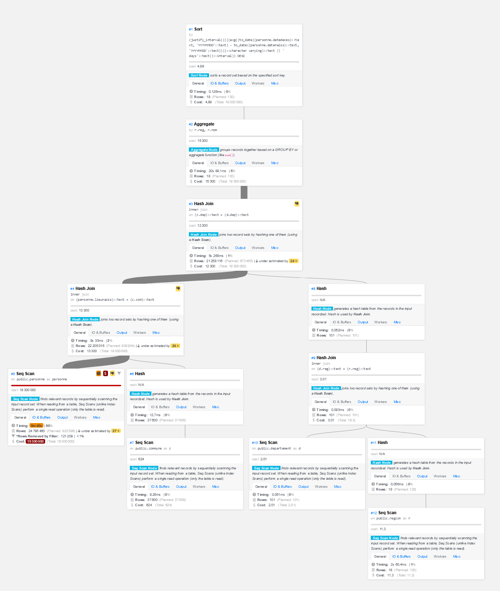

# TP2 de GGMD
Binôme:
- Eldar Kasmamytov p1712650
- Jérémy Gau p2111894

[Dépot du code](https://forge.univ-lyon1.fr/p2111894/ggmd_tp2_code.git)

A - Les premiers résultats des requêtes SQL (sans optimisation)
---

### Importer les regions, les departements et les communes de *ggmd_prof*

Importer les scripts SQL du TP1 (voir [[tp1-ggmd|GGMD TP1]]) sur chacune des VMs. Après:

```bash
# en tant qu'admin
psql -h localhost -U postgres -d insee -f ~/tp2/sql/create-foreign-server.sql

# en tant qu'etum2
psql -h localhost -U etum2 -d insee -f ~/tp2/sql/import-data.sql
```

### 2 - Quelles différences observez-vous entre la table 'personnes' et la table 'personne'?

**Réponse:** La différence entre les tables *'personnes'* et *'personne'* est que dans la première nous avons les données non traitées provenant directement de la base de données de l'INSEE, tandis que la deuxième ne contient que les données traitées préalablement. 

### 3 - Les requêtes SQL

#### Q1 - Le top 10 des personnes déclarées mortes le plus grand nombre de fois

```sql
SELECT nomprenom, datenaiss, lieunaiss, count(datedeces) as NB
FROM personne
GROUP BY nomprenom, datenaiss, lieunaiss
ORDER BY NB DESC
LIMIT 10;
```

Les temps d'exécution de la requête:
- Small: 16m 10s
- Medium: 6m 43s
- Large: 1m 12s

#### Q2 - Les homonymes (même nom et même premier prénom) qui sont nés la même année

```sql
SELECT split_part(p1.nomprenom, '*', 1)                                        as nom,
       split_part(split_part(REPLACE(p1.nomprenom, '/', ' '), '*', 2), ' ', 1) as prenom
FROM personne p1
         JOIN personne p2
              ON substr(p1.datenaiss, 1, 4) = substr(p2.datenaiss, 1, 4)
                  AND split_part(split_part(REPLACE(p1.nomprenom, '/', ' '), '*', 2), ' ', 1) =
                      split_part(split_part(REPLACE(p2.nomprenom, '/', ' '), '*', 2), ' ', 1)
                  AND split_part(p1.nomprenom, '*', 1) = split_part(p2.nomprenom, '*', 1)
                  AND p1.lieunaiss != p2.lieunaiss
GROUP BY nom, prenom;
```

Retourne au total **493 783 tuples**

Les temps d'exécution de la requête:
- Small: échoue (voir la section B.2)
- Medium: 31m 24s (1 page avec 500 tuples)
- Large: 4m 26s (1 page avec 500 tuples) et **17m 54s** (tous les tuples)

#### Q3 - La durée de vie moyenne des personnes selon leur région de naissance

```sql
SELECT r.reg,
       r.nom,
       count(p.*)                            as nb,
       justify_interval(((avg(to_date(p.datedeces, 'YYYYMMDD') - to_date(p.datenaiss, 'YYYYMMDD')))::varchar ||
                         ' days')::interval) as age_moyen
FROM region r
         JOIN departement d on r.reg = d.reg
         JOIN commune c on d.dep = c.dep
         JOIN personne_clean p on c.com = p.lieunaiss
GROUP BY r.reg, r.nom
ORDER BY age_moyen DESC;
```

Retourne bien **18 tuples**

Les temps d'exécution de la requête:
- Small: 10m 39s
- Medium: 11m 15s
- Large: 5m 48s 

Pour pouvoir utiliser la fonction `TO_DATE` sans aucun problème, nous avons créé 2 fonctions SQL auxiliaires qui ont pour but de produire une vue `personne_clean` qui ne contient que des **données "propres"** (éliminer les dates pas existantes, par exemple: 30 février).

La définition de la vue:
```sql
CREATE OR REPLACE VIEW personne_clean AS
SELECT *
FROM personne
WHERE date_isvalide(datenaiss)
  AND date_isvalide(datedeces)
  AND age_positif(datenaiss, datedeces);


DROP MATERIALIZED VIEW IF EXISTS personne_clean_m;
CREATE MATERIALIZED VIEW personne_clean_m AS
SELECT *
FROM personne
WHERE date_isvalide(datenaiss)
  AND date_isvalide(datedeces)
  AND age_positif(datenaiss, datedeces);

```

Une fonction pour vérifier si la date en entrée est valide ou pas:
```sql
CREATE OR REPLACE FUNCTION date_isvalide(date text)
    RETURNS boolean
    LANGUAGE plpgsql
    STRICT
    IMMUTABLE
AS
$function$
BEGIN
    RETURN date !~ '^[0-9]{4}[0-9]{2}00$' -- date jour inconnu
        AND date !~ '^[0-9]{4}00[0-9]{2}$' -- date mois inconnu
        AND date !~ '^0000[0-9]{2}[0-9]{2}$' -- date annee inconnue
        AND date !~ '^[0-9]{4}(02|04|06|09|11)31$' -- date 31 d'un mois de moins de 31 jours
        AND date !~ '^[0-9]{4}0230$' -- date 30 février
        AND date NOT LIKE '' -- date date de naissance inconnue
        AND (date !~ '^[0-9]{4}0229$'
            OR (date ~ '^[0-9]{4}0229$'
                AND substr(date, 1, 4)::int % 4 = 0
                AND substr(date, 1, 4) != '1900'
                 )
               );
EXCEPTION
    WHEN others THEN
        RETURN FALSE;
END;
$function$;
```

Une fonction pour vérifier si l'age d'une personne est positif:
```sql
CREATE OR REPLACE FUNCTION age_positif(datenaiss text, datedeces text)
    RETURNS boolean
    LANGUAGE plpgsql
    STRICT
    IMMUTABLE
AS
$function$
BEGIN
    RETURN to_date(datedeces, 'YYYYMMDD') - to_date(datenaiss, 'YYYYMMDD') > 0;
EXCEPTION
    WHEN others THEN
        RETURN FALSE;
END;
$function$;
```

La création des 2 fonctions auxiliaires et de la vue prends moins d'une seconde (en règle générale, <500ms).

### 4 - Les valeurs des paramètres des fichiers de configuration

Le seul paramètre actif dans les configurations des VMs est:
- **shared_buffers**: 128 MB (pour toutes les VMs)

Les autres sont commentés.

B - Traitement des requêtes sur grp-XX-small
---

### 1 - Les requêtes pouvant être traitées sur la VM Small

Les requêtes pouvant être traitées sur la VM Small sont: **Q1** et **Q3**.

#### Les plans d'exécution:

Après avoir généré les plans d'exécution des requêtes SQL avec
```sql
EXPLAIN (analyse, verbose, costs, buffers, timing, summary, format json)
-- REQUETE SQL ...
```
et en les éditant sur [Explain Dalibo](https://explain.dalibo.com), on obtient les résultats suivants:

##### La requête Q1 (temps d'exéc du `EXPLAIN`: 14m 17s):


##### La requête Q3 (temps d'exéc du `EXPLAIN`: 11m 11s):


### 2 - L'exécution d'une requête qui n'a pas pu aboutir

L'exécution de la requête **Q2** entraîne une erreur:

```log
[53100] ERROR: could not write to file "base/pgsql_tmp/pgsql_tmp19593.1": No space left on device
```

L'erreur est survenue à cause d'**espace de stockage insuffisant** pour sauvegarder des résultats intermédiaires de la requête.

#### Le plan d'exécution de la Q2:


### 3 - Optimisations possibles

#### Première proposition
Le résultat de la commande ci-dessous montre qu'il n'y a que **3.3 GB d'espace disponible** sur la VM Small.
```bash
ubuntu@grp-27-small:/tmp$ df -h
Filesystem      Size  Used Avail Use% Mounted on
/dev/vda1       9.6G  6.3G  3.3G  66% /
# ...
```
Une des solutions est d'augmenter l'espace attribué à cette VM.

#### Autres solutions

1) **Indexer les colonnes** de la table qui sont souvent utilisées pour trier les données (par exemple, les conditions dans la clause `WHERE`). Cela nous permettra d'éviter la recherche sequentielle lente dans la table, et à la place faire des recherches optimisées dans une table de plus petite taille contenant uniquement des indexes. <br/>
    Les défauts de cette approche:
    - Nécéssité de les créer au préalable (parfois prend trop de temps)
    - Requiert plus d'espace disponible sur le disque
<br/>
1) **Optimiser la configuration** du SGBD PostgreSQL.

Nous appliquerons ces solutions dans la section suivante.

### 4 - Appliquer un protocole de résolution

#### 4.1 - Ajout de l'indexation

##### Indexes fonctionnels
Etant donné le fait que nous utilisons des fonctions pour recupérer les noms et les prénoms, on pourrait optimiser les comparaisons en ajoutant des indexes fonctionnels.

Par exemple, on peut créer une indexation suivante des prénoms:
```sql
CREATE INDEX idx_prenoms ON personne USING HASH (
  split_part(split_part(REPLACE(nomprenom, '/', ' '), '*', 2), ' ', 1)
);
```

Et une autre pour indexer les noms comme suit:
```sql
CREATE INDEX idx_noms ON personne USING HASH (
  split_part(nomprenom, '*', 1)
);
```

Indexation des années de naissance:
```sql
CREATE INDEX idx_annees_naiss ON personne (
  substr(datenaiss, 1, 4)
);
```

Pour l'age moyen des personnes:
```sql
CREATE INDEX idx_age_moyen ON personne (
  justify_interval(
    (
      (
        avg(
          to_date(datedeces, 'YYYYMMDD') -
          to_date(datenaiss, 'YYYYMMDD')
        )
      )::varchar || ' days'
    )::interval
  )
);
```

##### Les algorithmes d'indexation utilisés
Nous utilisons l'algorithm d'indexation par défaut (`B-Trees`) pour les comparaisons des **années**, car il correpond parfaitement pour les comparaisons des nombres.

Pour **les noms** et **les prénoms**, l'algorithm d'indexation utilisé est `Hash`, car on n'utilise que l'opérateur `=`.

##### Comparaison des performances

La VM Small n'a pas assez de place pour stocker toutes les tables d'indexation. En conséquence, nous n'avons pas pu tester tous les indexes ci-dessus. 

#### 4.2 - Optimisation de la configuration

##### Changements effectués
| Paramètre | Ancienne valeur | Nouvelle valeur |
| --- | --- | --- |
| shared_buffers | 128MB | 1024MB |
| effective_cache_size | unused | 1024MB |
| wal_sync_method | unused | fsync |
| wal_buffers | unused | -1 |
| max_connections | 100 | 10 |
| work_mem | unused | 512MB |
| maintenance_work_mem | unused | 1024MB |
| autovacuum_work_mem | unused | -1 |
| autovacuum | unused | on |
| track_counts | unused | on |

##### Comparaison des performances

* **Q1**:
  - Execution time: 8m 17s
  - Planning time: 196ms  
  - Cout : 3 890 000
* **Q2**:
  - Execution time: N/A
  - Planning time: N/A
  - Cout : 11 500 000
* **Q3**:
  - Execution time: 8m 28s  
  - Planning time: 2s 323ms  
  - Cost : 19 300 000

C - Traitement des requêtes sur grp-XX-medium
---

#### Les plans d'exécution:

##### Q1 (temps d'exéc du `EXPLAIN`: )

##### Q2 (temps d'exéc du `EXPLAIN`: 38m 35s)

##### Q3 (temps d'exéc du `EXPLAIN`: 11m 21s)

D - Traitement des requêtes sur grp-XX-large
---

#### Les plans d'exécution:

##### Q1 (temps d'exéc du `EXPLAIN`: )

##### Q2 (temps d'exéc du `EXPLAIN`: 13m 20s)

##### Q3 (temps d'exéc du `EXPLAIN`: 8m 21s)

