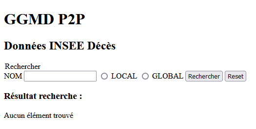
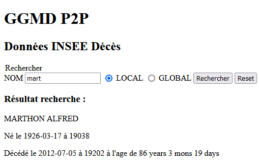

Pré-requis
---

Installer `yarn` globalement (`-g`) via `npm`.

Installer les dépendances via `yarn`:
- `orbit-db`
- la bonne version d'`ipfs` (ici, 0.64.2). La 0.65 ne fonctionne pas.

```json
{
  "dependencies": {
    "ipfs": "^0.64.2",
    "orbit-db": "^0.28.7"
  }
}
```

> Lien vers notre [dépôt git](https://forge.univ-lyon1.fr/p2111894/ggmd_tp3_code) sur la forge Lyon 1.

Premiers pas avec OrbitDB
---

### Création d'une Key-Value DB

```js
import {getKeyValueDB} from "./db_function.js";

async function main() {
    const db = await getKeyValueDB('ggmd-27');
    console.log(db.address.toString())
    const identity = db.identity
    console.log(identity.toJSON())
}

main()
```

```bash
ubuntu@grp-27-medium:~/ggmd_tp3_code$ node creation_kvstore.js | tee logs_creation.txt
generating Ed25519 keypair...
to get started, enter:

        jsipfs cat /ipfs/QmRaaUwTNfwgFZpeUy8qrZwrp2dY4kCKmmB5xEqvH3vtD1/readme

Swarm listening on /ip4/127.0.0.1/tcp/4002/p2p/12D3KooWCpYw8F2Vz32AoGuMwwDFuYzrkhKnRzbCuqn6empaV3N1
Swarm listening on /ip4/192.168.246.190/tcp/4002/p2p/12D3KooWCpYw8F2Vz32AoGuMwwDFuYzrkhKnRzbCuqn6empaV3N1
Swarm listening on /ip4/127.0.0.1/tcp/4003/ws/p2p/12D3KooWCpYw8F2Vz32AoGuMwwDFuYzrkhKnRzbCuqn6empaV3N1
/orbitdb/zdpuArSxtUdrrheJwJStoQjTZPng3N1vLPkkVKSPLZEe5K5BD/ggmd-27
{
  id: '03a7f0e2d83c71c5b00aeb62e816f13acc53f2c436e40f63c50cd6f8234c7ee1f1',
  publicKey: '04b24c22016c44dd9f7bf3b66f0adfd8d8b18cd59fe137875a4c2478ff962e8514ff1b07d4b7c8d669bff9b89304537898e8c4505b795b503ebcb04e329e654b19',
  signatures: {
    id: '3045022100bc8f89cc1354eeba290869c5890f317192d1f21d617d6a9777a3644993c1087f0220516bc42837412aee29725279e172f91284f9d22b42932f284906528f07c7ffde',
    publicKey: '304402200dc33f9f0f5381aa6433aab14959d47c55ba069ac8ae9f319afc2a6e847328980220721008bff8b6b7fad5d32a77dd665b85b841bbe3f491840c4f0f2f8ced573011'
  },
  type: 'orbitdb'
}
```

### Ajouter deux éléments

```js
import {getKeyValueDB} from "./db_function.js";

const db = await getKeyValueDB('ggmd-27');
await db.put('el1', 'value1');
await db.put('el2', 'value2');
console.log(db.all);
```

```bash
ubuntu@grp-27-medium:~/ggmd_tp3_code$ node script2_3.js
Swarm listening on /ip4/127.0.0.1/tcp/4002/p2p/12D3KooWCpYw8F2Vz32AoGuMwwDFuYzrkhKnRzbCuqn6empaV3N1
Swarm listening on /ip4/192.168.246.190/tcp/4002/p2p/12D3KooWCpYw8F2Vz32AoGuMwwDFuYzrkhKnRzbCuqn6empaV3N1
Swarm listening on /ip4/127.0.0.1/tcp/4003/ws/p2p/12D3KooWCpYw8F2Vz32AoGuMwwDFuYzrkhKnRzbCuqn6empaV3N1
{ el1: 'value1', el2: 'value2' }
```

### Modifier la valeur du premier élément inséré et supprimer le second

```js
import {getKeyValueDB} from "./db_function.js";

const db = await getKeyValueDB('ggmd-27');
await db.put('el1', 'new value');
await db.del('el2');
console.log(db.all);
```

```bash
ubuntu@grp-27-medium:~/ggmd_tp3_code$ node script4.js
Swarm listening on /ip4/127.0.0.1/tcp/4002/p2p/12D3KooWCpYw8F2Vz32AoGuMwwDFuYzrkhKnRzbCuqn6empaV3N1
Swarm listening on /ip4/192.168.246.190/tcp/4002/p2p/12D3KooWCpYw8F2Vz32AoGuMwwDFuYzrkhKnRzbCuqn6empaV3N1
Swarm listening on /ip4/127.0.0.1/tcp/4003/ws/p2p/12D3KooWCpYw8F2Vz32AoGuMwwDFuYzrkhKnRzbCuqn6empaV3N1
{ el1: 'new value' }
```

### Sélectionner les personnes décédées après le 01/07/2012

```js
import {getDocsDB} from "./db_function.js";

const db = await getDocsDB('ggmd-27', {indexBy:'nom'});
console.log(db.query(doc => new Date(doc.datedeces) > new Date('2012-07-01')));
```

```bash
ubuntu@grp-27-medium:~/ggmd_tp3_code$ node script6.js
options { indexBy: 'nom' }
Swarm listening on /ip4/127.0.0.1/tcp/4002/p2p/12D3KooWCpYw8F2Vz32AoGuMwwDFuYzrkhKnRzbCuqn6empaV3N1
Swarm listening on /ip4/192.168.246.190/tcp/4002/p2p/12D3KooWCpYw8F2Vz32AoGuMwwDFuYzrkhKnRzbCuqn6empaV3N1
Swarm listening on /ip4/127.0.0.1/tcp/4003/ws/p2p/12D3KooWCpYw8F2Vz32AoGuMwwDFuYzrkhKnRzbCuqn6empaV3N1
[
  {
    _id: 1,
    age: '86 years 3 mons 19 days',
    nom: 'MARTHON',
    prenoms: 'ALFRED',
    datedeces: '2012-07-05',
    datenaiss: '1926-03-17',
    lieudeces: '19202',
    lieunaiss: '19038'
  }
]
```

Mise en place des données INSEE
---

### Importer les données INSEE

```js
import {getDocsDB, stopOrbitDB} from "./db_function.js";
import fs from "fs";

const {ipfs, orbitdb, db} = await getDocsDB('ggmd-27', {indexBy: 'nom'});
const data = fs.readFileSync('F27.json', 'utf8');
const people = JSON.parse(data);
console.log(`Successfully parsed ${people.length} objects`);
const imports = people.map((person) => db.put(person).then((hash) => console.log(`Imported with hash ${hash}`)));

Promise.all(imports)
    .then(count => {
        console.log(`Successfully imported ${count.length} objects`);
        stopOrbitDB(ipfs, orbitdb);
    })
    .catch(err => console.log(`Error importing objects: ${err}`));
```

```bash
ubuntu@grp-27-medium:~/ggmd_tp3_code$ node import_insee.js
options { indexBy: undefined, amount: -1 }
Swarm listening on /ip4/127.0.0.1/tcp/4002/p2p/12D3KooWCpYw8F2Vz32AoGuMwwDFuYzrkhKnRzbCuqn6empaV3N1
Swarm listening on /ip4/192.168.246.190/tcp/4002/p2p/12D3KooWCpYw8F2Vz32AoGuMwwDFuYzrkhKnRzbCuqn6empaV3N1
Swarm listening on /ip4/127.0.0.1/tcp/4003/ws/p2p/12D3KooWCpYw8F2Vz32AoGuMwwDFuYzrkhKnRzbCuqn6empaV3N1
Successfully parsed 1000 objects
Successfully imported 1000 objects
```

### Afficher les 10 premières lignes de la base

```js
import {getDocsDB, stopOrbitDB} from "./db_function.js";

const {ipfs, orbitdb, db} = await getDocsDB('ggmd-27', {indexBy: 'nom', amount: 10});
const all = db.all;
for (const person of all) {
    console.log(await db.get(person.payload.key));
}
console.log("End of log")

stopOrbitDB(ipfs, orbitdb);
```

```bash
ubuntu@grp-27-medium:~/ggmd_tp3_code$ node load_10_dead.js
options { amount: 10 }
Swarm listening on /ip4/127.0.0.1/tcp/4002/p2p/12D3KooWCpYw8F2Vz32AoGuMwwDFuYzrkhKnRzbCuqn6empaV3N1
Swarm listening on /ip4/192.168.246.190/tcp/4002/p2p/12D3KooWCpYw8F2Vz32AoGuMwwDFuYzrkhKnRzbCuqn6empaV3N1
Swarm listening on /ip4/127.0.0.1/tcp/4003/ws/p2p/12D3KooWCpYw8F2Vz32AoGuMwwDFuYzrkhKnRzbCuqn6empaV3N1
[
  {
    _id: 27000,
    age: '74 years 11 mons 18 days',
    nom: 'HAYET',
    prenoms: 'MICHELE',
    datedeces: '2012-07-04',
    datenaiss: '1937-07-17',
    lieudeces: '76540',
    lieunaiss: '76484'
  }
]
[
  {
    _id: 26999,
    age: '66 years 28 days',
    nom: 'OUKSEL',
    prenoms: 'MERIEM',
    datedeces: '2012-07-10',
    datenaiss: '1946-06-12',
    lieudeces: '76540',
    lieunaiss: '93352'
  }
]
[
  {
    _id: 26998,
    age: '68 years 6 mons 23 days',
    nom: 'ALLEAUME',
    prenoms: 'DENISE',
    datedeces: '2012-07-09',
    datenaiss: '1943-12-17',
    lieudeces: '76540',
    lieunaiss: '14299'
  }
]
[
  {
    _id: 26997,
    age: '59 years 10 days',
    nom: 'DETOUTEVILLE',
    prenoms: 'PIERRE',
    datedeces: '2012-07-08',
    datenaiss: '1953-06-28',
    lieudeces: '76540',
    lieunaiss: '76105'
  }
]
[
  {
    _id: 26996,
    age: '76 years 2 mons 23 days',
    nom: 'DELAFENETRE',
    prenoms: 'CHRISTIANE',
    datedeces: '2012-07-06',
    datenaiss: '1936-04-13',
    lieudeces: '76540',
    lieunaiss: '76728'
  }
]
[
  {
    _id: 26995,
    age: '52 years 10 mons 5 days',
    nom: 'SEHIER',
    prenoms: 'THIERRY',
    datedeces: '2012-07-08',
    datenaiss: '1959-09-03',
    lieudeces: '76540',
    lieunaiss: '76540'
  }
]
[
  {
    _id: 26994,
    age: '65 years 14 days',
    nom: 'MOIGNE',
    prenoms: 'ROGER',
    datedeces: '2012-07-15',
    datenaiss: '1947-07-01',
    lieudeces: '76540',
    lieunaiss: '76497'
  }
]
[
  {
    _id: 26993,
    age: '72 years 4 mons 26 days',
    nom: 'HOMONT',
    prenoms: 'MARIA',
    datedeces: '2012-07-01',
    datenaiss: '1940-02-04',
    lieudeces: '76534',
    lieunaiss: '76351'
  }
]
[
  {
    _id: 26992,
    age: '94 years 9 mons 25 days',
    nom: 'GADIOUX',
    prenoms: 'LOUISE',
    datedeces: '2012-02-29',
    datenaiss: '1917-05-04',
    lieudeces: '76533',
    lieunaiss: '79074'
  }
]
[
  {
    _id: 26991,
    age: '90 years 10 mons 24 days',
    nom: 'CHENEL',
    prenoms: 'YVONNE',
    datedeces: '2012-06-05',
    datenaiss: '1921-07-12',
    lieudeces: '76533',
    lieunaiss: '76351'
  }
]
End of log
```

Développement d'un petit moteur de recherche
---

### Compléter server.js

```js
import express from 'express';
import {getDocsDB} from "./db_function.js";

const index = `<!doctype html>
<html lang="fr">
    <head>
        <title>GGMD - TP P2P</title>
        <script src="https://unpkg.com/htmx.org@1.4.1"></script>
        <script src="https://unpkg.com/htmx.org/dist/ext/json-enc.js"></script>
        <script src="https://unpkg.com/hyperscript.org@0.8.1"></script>
    </head>
    <body>
        <h1>GGMD P2P</h1>
        <h2>Données INSEE Décès</h2>
        <form hx-post="/" hx-ext="json-enc" hx-target="#recherche" _="on htmx:afterRequest reset() me">
            <legend>Rechercher</legend>
            <label for="nomfamille">NOM</label>
            <input type="text" name="nomfamille" id="nomfamille" />
            <input type="radio" id="searchMode1" name="searchMode" value="LOCAL">
            <label for="searchMode1">LOCAL</label>
            <input type="radio" id="searchMode2" name="searchMode" value="GLOBAL">
            <label for="searchMode2">GLOBAL</label>
            <button type="submit">Rechercher</button>
            <button type="reset">Reset</button>  
        </form>
        <div>
            <h3>Résultat recherche : </h3>
            <div id="recherche" hx-get="/recherche" hx-trigger="load">
            </div>
        </div>
    </body>
</html>
`
const port = 3000;

const app = express()

const {ipfs, orbitdb, db} = await getDocsDB('ggmd-27', {indexBy: 'nom'});

app.get('/recherche', (req, res) => {
    console.log('/recherche');

    res.setHeader('content-type', 'text/html');
    res.send(`<li>Aucun élément trouvé</li>`);
})

app.post('/', express.json(), async (req, res) => {
    res.setHeader('content-type', 'text/html');
    const nomfamille = req.body.nomfamille;
    const searchMode = req.body.searchMode ? req.body.searchMode : 'LOCAL';
    let result = [];
    if (searchMode === 'LOCAL') {
        result = await db.get(nomfamille);
    }

    let html = '';
    for (const doc of result) {
        html +=
            `<p>${doc.nom} ${doc.prenoms}</p>
            <p>Né le ${doc.datenaiss} à ${doc.lieunaiss}</p>
            <p>Décédé le ${doc.datedeces} à ${doc.lieudeces} à l'age de ${doc.age}</p>
            `;
    }
    res.send(html);
})

app.get('/', (req, res) => {
    console.log('index');
    res.setHeader('content-type', 'text/html');
    res.send(index);
})

app.listen(port);

console.log(`Listening on port ${port}`);
```

#### Ajout d'un bouton radio dans le formulaire



#### Le résultat d'une recherche composée d'un nom de famille



> Nous avons essayé de faire la dernière partie "Accès distant", mais nous n'avons pas reussi, puisque la documentation ne correspond pas au code de la version utilisée.